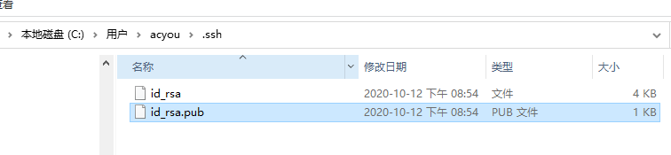
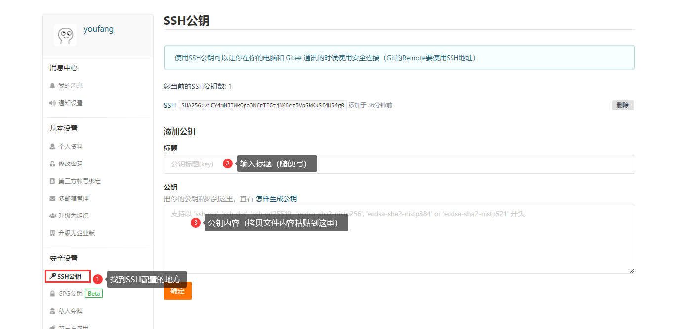

## Git SSH公钥配置

参考：[SSH 公钥设置](https://gitee.com/help/articles/4191)


## 第一步：配置用户名和邮箱
```
PS C:\Users\acyou> git config --global user.name "youfang"
PS C:\Users\acyou> git config --global user.email "youfang@acyou.cn"
```

## 第二步：生成SSH
```
PS C:\Users\acyou> ssh-keygen -t rsa -C "youfang@acyou.cn"
```

一路回车

生成文件：`.ssh\id_rsa.pub`



## 第三步：将文件内容复制到平台



## 第四步：添加主机到本机SSH可信列表
添加后，在终端（Terminal）中输入对应平台的命令：

```
码云：   ssh -T git@gitee.com

GitHub： ssh -T git@github.com
```

> 这个是看平台的，使用对应的平台命令
>
> 首次使用需要确认并添加主机到本机SSH可信列表。若返回 Hi XXX! You've successfully authenticated, but Gitee.com does not provide shell access. 内容，则证明添加成功。

## 第五步：测试
1. 使用`git clone git@gitee.com:f981545521/xxx.git`命令
2. 或者直接使用IDEA导入皆可
