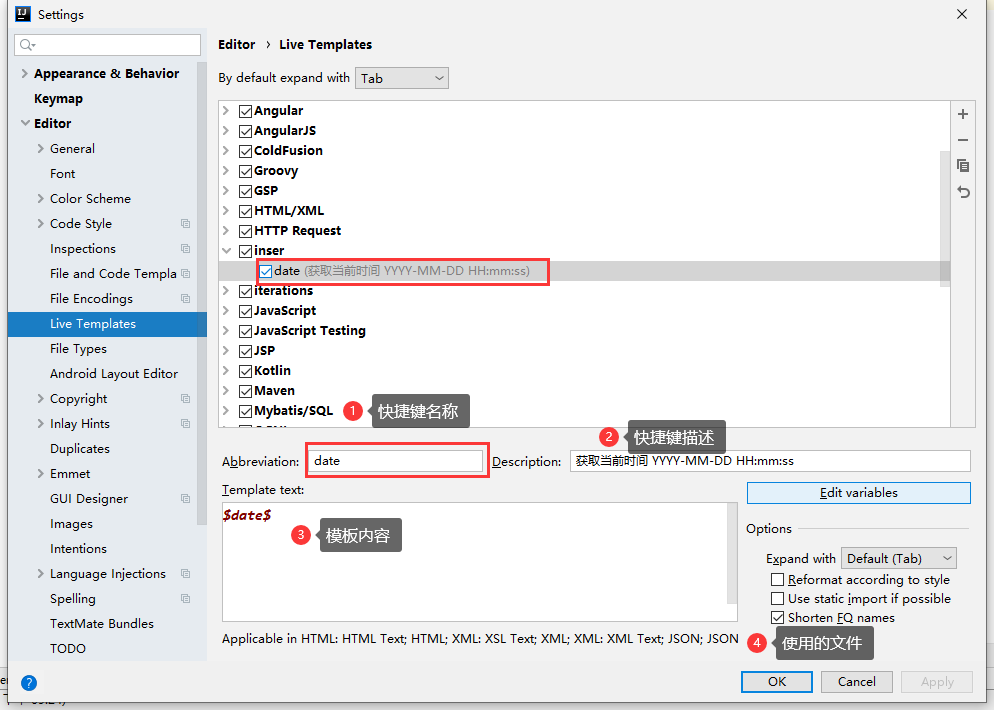
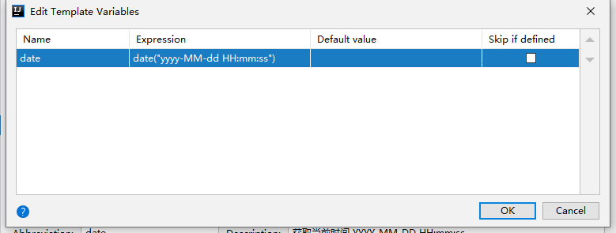

### Idea 添加JDK自带的反编译工具javap
- [Idea 添加JDK自带的反编译工具javap](https://blog.csdn.net/qq_40646143/article/details/105833724?utm_medium=distribute.pc_relevant.none-task-blog-BlogCommendFromMachineLearnPai2-1.channel_param&depth_1-utm_source=distribute.pc_relevant.none-task-blog-BlogCommendFromMachineLearnPai2-1.channel_param)

1. File -> settings -> Tools -> ExternalTools  #> add

2. 配置 Tool

    

### IDEA快速插入当前时间（自定义快捷键）
1. File -> settings -> Editor -> Live Templates。
2. 点击右侧加号，先添加一个自定义group。

    
3. 添加Live Templates，编辑 templates 的属性，名称，描述，触发 idea 默认的变量。

    
4. Edit variables 在表达式中输入，日期的格式。

    
5. 在 idea 中输入 date ，出现提示框，回车，生成当前日期。

    

### 提高IDEA的启动速度
- 方法一：Help -> Edit Custom VM Options...
- 方法二：编辑文件：`C:\Users\acyou\.IntelliJIdea2019.3\config\idea64.exe.vmoptions`

```
-Xms1G
-Xmx2G
-XX:ReservedCodeCacheSize=500m

```

### 如何让IntelliJ IDEA像eclipse一样同一窗口查看多个项目

点击File -> Project Structure-Modules -> + -> import Module -> 选择项目 -> Maven ...


最终效果图


> 原理：打开一下项目，把另外一个项目作为一个module导入到这个项目里。