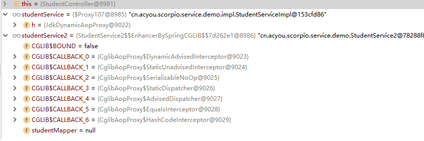

## Spring的事务与动态代理
https://www.cnblogs.com/qizhelongdeyang/p/12411576.html
http://www.itrensheng.com/archives/spring_transactional_uneffect

- SpringBoot2.x默认的代理模式设置成cglib代理
- 如果偏要springboot 走JDK动态代理，那么需要在application.properties里面配置
```
spring.aop.proxy-target-class=false
```

一旦使用了AOP（如：@Transactional， @Aspect），Spring就会创建其代理类。

Spring已经放弃了JDK动态代理，默认使用CGLIB。


> 参考：https://blog.csdn.net/u011242657/article/details/99747011

#### Spring的事务处理方式
1. 编程式事务
在代码中显式调用 beginTransaction()、commit()、rollback() 等事务管理相关的方法，这就是编程式事务管理。
2. 声明式事务
通过：`@Transactional `注解。底层是建立在Spring AOP 机制之上的，其本质是对目标方法前后进行拦截，并在目标方法开始之前创建或者加入一个事务，在执行完目标方法之后根据执行情况提交或者回滚事务。

#### 动态代理
利用反射机制在运行时创建代理类，为代理的对象提供增强的功能。

#### 静态代理与动态代理的区别
- 静态代理
运行之前，就创建代理类Proxy。由于每个代理类只能为一个接口服务，如果需要代理的类很多，那么就需要编写大量的代理类。

- 动态代理
利用反射机制在运行时创建代理类，为代理的对象提供增强的功能。
   
   底层实现：
    1. 通过实现 InvocationHandler 接口创建自己的调用处理器；
    2. 通过为 Proxy 类指定 ClassLoader 对象和一组 interface 来创建动态代理类；
    3. 通过反射机制获得动态代理类的构造函数，其唯一参数类型是调用处理器接口类型；
    4. 通过构造函数创建动态代理类实例，构造时调用处理器对象作为参数被传入。


#### 动态代理为什么要接口？
主要原因是代理类已经继承了Proxy类，Java不支持多继承所以导致动态代理需要使用接口，接口支持多继承。
添加CGLIB库aspectjweaver-xxx.jar

5、JDK动态代理和CGLIB字节码生成的区别？
1）JDK动态代理只能对实现了接口的类生成代理，而不能针对类。

2）CGLIB是针对类实现代理，CGLib底层采用ASM字节码生成框架，使用字节码技术生成代理类。


#### 事务失效场景
1. 底层数据库引擎不支持事务。
MySql需要是InnoDB引擎。
2. 没有配置事务。-- 加`@Transactional`注解。
2. 标注修饰无效
接口定义的方法是public的，不能使用static的修饰符。
可以支持动态代理的方法只能是使用“public”或“public final”修饰符的方法，其它方法不可能被动态代理
3. 方法自调用，没有通过代理类调用，就没有事务的处理。
4. 多个事务管理器


