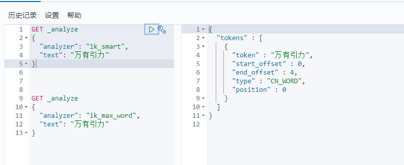
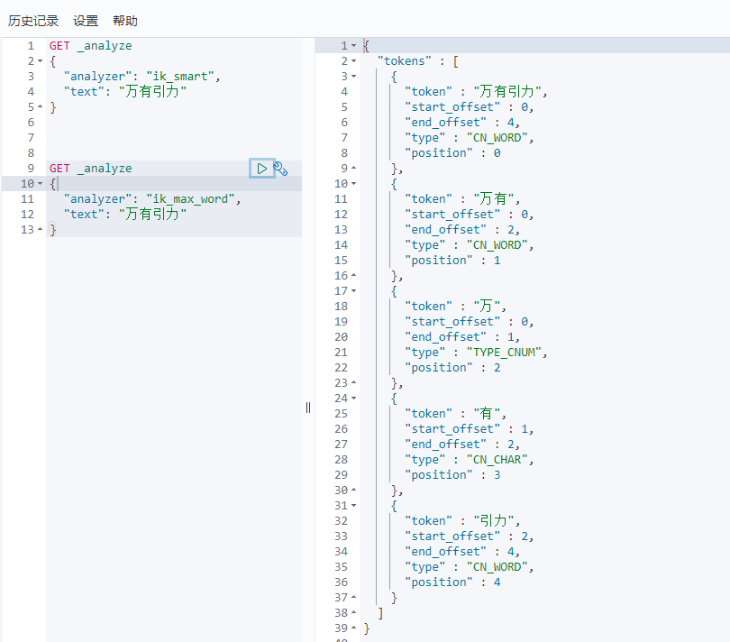
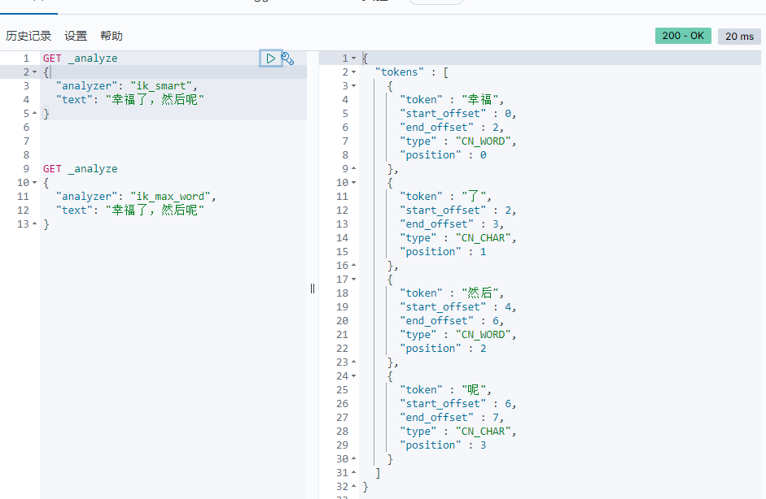
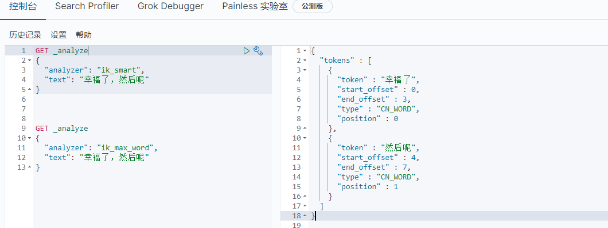

## Elasticsearch IK分词器
### 安装
参考[ElasticSearch安装](1.ElasticSearch介绍与相关工具安装.md)

### 什么是IK分词器
把一个中文或者英文识别成关键字。

### 分词算法
- ik_smart
最少切分



- ik_max_word
最细粒度划分，穷尽词库的可能。



**分词算法测试**
```
GET _analyze
{
  "analyzer": "ik_smart",
  "text": "幸福了，然后呢"
}

GET _analyze
{
  "analyzer": "ik_max_word",
  "text": "幸福了，然后呢"
}
```

发现问题：有的词不希望被拆开：


这种需要自己的分词。

1. E:\developer\es\elasticsearch-7.9.1\plugins\ik\config目录下新建自己的dic文件：`customer.dic`
    ```
    幸福了
    然后呢
    ```
2. 修改配置文件`E:\developer\es\elasticsearch-7.9.1\plugins\ik\config\IKAnalyzer.cfg.xml`：
    ```
        <entry key="ext_dict">customer.dic</entry>
    ```
3. 重启ES
4. 继续访问



> 以后我们可以配置自己的分词规则。
### 命令测试


