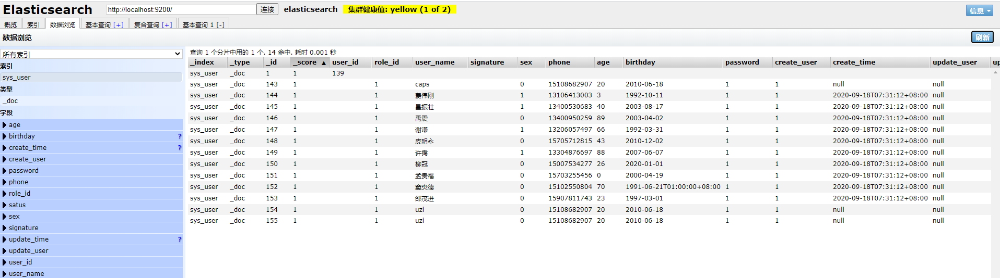

## ES中的数据
Elasticsearch是一个分布式搜索服务，提供Restful API，底层基于Lucene， 采用多shard的方式保证数据安全，并且提供自动resharding的功能，github等大型的站点也采用Elasticsearch作为其搜索服务。

对于Elasticsearch，如果要在项目中使用，第一个要解决的问题就是，如何将数据库中的数据同步到Elasticsearch，下面常见的几种中方案：

1. 修改代码，修改插入数据库的代码，同时插入Elasticsearch。
2. 修改代码，修改插入数据库的代码，同时放入消息队列，在消息队列的另一端进行插入Elasticsearch。
3. 使用 Elasticsearch技术栈的Logstash，编写sql语句定时执行搜集数据，并插入到Elasticsearch。

在上诉方案中，一三都有明显缺陷，第二种方案是目前采用最多的，但还是会对原有项目代码有侵入，并且要引入消息队列。

> 引用自[Totoro](https://github.com/zhongchengxcr/canal-elasticsearch)

### 1. 数据来源
1. 数据库中获取
2. 消息队列中获取
3. [Mysql数据同步Elasticsearch方案总结](https://my.oschina.net/u/4000872/blog/2252620)
4. [腾讯云 - 数据迁移和同步](https://cloud.tencent.com/document/product/845/35568)
5. [mysql数据实时同步到Elasticsearch](https://cloud.tencent.com/developer/article/1145942)
6. [阿里云 - 同步方案选取指南](https://help.aliyun.com/document_detail/170426.html?spm=a2c4g.11174283.6.822.628c7958NrxjDJ)

#### 1.1 Logstash JDBC数据同步
> Logstash 是免费且开放的服务器端数据处理管道，能够从多个来源采集数据，转换数据，然后将数据发送到您最喜欢的“存储库”中。

通过logstash-input-jdbc插件实现通过Logstash批量查询RDS中的数据，并将数据迁移到ES。实现的本质是该插件会定期对RDS中的数据进行循环轮询，从而在当前循环中找到上次插入或更改的记录，然后批量查询这些记录并迁移至ES。与DTS同步方案相比，该方案的实时性较差，存在秒级延迟。

##### 适用场景：
1. 同步全量数据，接受分级延迟的场景。
2. 批量查询数据然后进行同步的场景。

##### 实操：
1. 安装两个插件：
```cmd
    PS E:\developer\es\logstash-7.9.1\bin> .\logstash-plugin.bat install logstash-integration-jdbc
    Validating logstash-integration-jdbc
    Installing logstash-integration-jdbc
    Installation successful
```

```cmd
    PS F:\xpndev\elasticsearch56\logstash-5.6.11\logstash-5.6.11\bin> .\logstash-plugin.bat install logstash-output-elasticsearch
    "warning: ignoring JAVA_TOOL_OPTIONS=$JAVA_TOOL_OPTIONS"
    Validating logstash-output-elasticsearch
    Installing logstash-output-elasticsearch
    Installation successful
```
2. 配置文件`E:\developer\es\logstash-7.9.1\bin\customer\sync_user.cfg`：
```editorconfig

input {
  jdbc {
    type => "user"
    jdbc_driver_library => "./customer/mysql-connector-java-8.0.21.jar"
    jdbc_driver_class => "com.mysql.jdbc.Driver"
    jdbc_connection_string => "jdbc:mysql://localhost:3306/scorpio?useUnicode=true&characterEncoding=UTF-8&allowMultiQueries=true&serverTimezone=UTC&useSSL=false"
    jdbc_user => "root"
    jdbc_password => "root123"
	#1min 执行一次，logstash不支持秒级更新，最小时间单位确实是1分钟
    schedule => "* * * * *"
    statement => "SELECT * FROM scorpio.sys_user WHERE create_time > :sql_last_value"
    use_column_value => true
    tracking_column_type => "timestamp"
    tracking_column => "create_time"
    record_last_run => "true"
    last_run_metadata_path => "syncpoint_user"
  }
}

output {
    if[type] == "user" {
      elasticsearch {
        hosts => "localhost:9200"
        index => "user"
        document_type => "%{type}"
        document_id => "%{user_id}"
      }
    }
    stdout {
      codec => json_lines
    }
}

```
3. 下载MySQL驱动到目录：`E:\developer\es\logstash-7.9.1\bin\customer\mysql-connector-java-8.0.21.jar`
    可以在Maven仓库中直接下载：`https://mvnrepository.com/artifact/mysql/mysql-connector-java`

4. 运行
```cmd
    PS E:\developer\es\logstash-7.9.1\bin> .\logstash.bat -f .\customer\sync_user.cfg
```

- [参考文档](https://segmentfault.com/a/1190000011784259)
- [logstash全量和增量同步数据到mysql](https://blog.csdn.net/lumengmeng_csdn/article/details/89482086)

全量同步:

PS F:\xpndev\elasticsearch6.4\logstash-5.6.11\logstash-5.6.11\bin> .\logstash.bat -f F:\xpndev\elasticsearch6.4\mysql.conf

#### 2.1 使用 go-mysql-elasticsearch 开源工具同步数据到 ES
go-mysql-elasticsearch是一项将MySQL数据自动同步到Elasticsearch的服务。

它用于mysqldump首先获取原始数据，然后与binlog增量同步数据。

[go-mysql-elasticsearch 地址](https://github.com/siddontang/go-mysql-elasticsearch)

##### 缺点：
1. 需要先安装GO环境。[GO 环境下载地址](https://golang.org/dl/)
2. MySQL支持的版本<8.0
3. ES支持的版本<6.0


#### 3. 使用Canal 进行同步 
阿里开源的一个中间件，主要是用来同步数据库数据，简单的说就是将canal伪装成一个数据库的从节点，通过订阅的方式获取住数据库节点的binlog，解析binlog进行后续的业务操作，现在主要支持mysql。
  
- [版本下载](https://github.com/alibaba/canal/releases/)

##### 实操：
容易出错，请按照步骤一步一步来：

第一步：修改MySQL的配置（开启 Binlog 写入功能）my.cnf：
```shell script
[mysqld]
log-bin=mysql-bin # 开启 binlog
binlog-format=ROW # 选择 ROW 模式
server_id=1 # 配置 MySQL replaction 需要定义，不要和 canal 的 slaveId 重复
```
第二步：运行canal服务端：
1. 从版本下载中选择合适的版本下载：[canal.deployer-1.1.5-SNAPSHOT](https://github.com/alibaba/canal/releases/download/canal-1.1.5-alpha-2/canal.deployer-1.1.5-SNAPSHOT.tar.gz)
2. 解压
3. 编辑配置文件：vi  /conf/example/instance.properties
```properties
## mysql serverId
canal.instance.mysql.slaveId = 1234
#position info，需要改成自己的数据库信息
canal.instance.master.address = 127.0.0.1:3306 
canal.instance.master.journal.name = 
canal.instance.master.position = 
canal.instance.master.timestamp = 
#canal.instance.standby.address = 
#canal.instance.standby.journal.name =
#canal.instance.standby.position = 
#canal.instance.standby.timestamp = 
#username/password，需要改成自己的数据库信息
canal.instance.dbUsername = root  
canal.instance.dbPassword = root123
canal.instance.defaultDatabaseName =
canal.instance.connectionCharset = UTF-8
#table regex
canal.instance.filter.regex = .\*\\\\..\*
```
4. 启动：`bin/startup.sh`
5. 检查日志：
```shell script
vi logs/canal/canal.log
vi logs/example/example.log
```
> 没有日志时，无法继续，请重复检查！

- [Canal Deployer 部署指南](https://github.com/alibaba/canal/wiki/QuickStart)

第三步：运行canal适配器：
1. 从版本下载中选择合适的版本下载：[canal.adapter-1.1.5-SNAPSHOT](https://github.com/alibaba/canal/releases/download/canal-1.1.5-alpha-2/canal.adapter-1.1.5-SNAPSHOT.tar.gz)
2. 解压
3. 修改启动器配置: application.yml
```shell script
server:
  port: 8081
spring:
  jackson:
    date-format: yyyy-MM-dd HH:mm:ss
    time-zone: GMT+8
    default-property-inclusion: non_null

canal.conf:
  mode: tcp #tcp kafka rocketMQ rabbitMQ
  flatMessage: true
  zookeeperHosts:
  syncBatchSize: 1000
  retries: 0
  timeout:
  accessKey:
  secretKey:
  consumerProperties:
    # canal tcp consumer
    canal.tcp.server.host: 127.0.0.1:11111
    canal.tcp.zookeeper.hosts:
    canal.tcp.batch.size: 500
    canal.tcp.username:
    canal.tcp.password:

  srcDataSources:
    defaultDS:
      url: jdbc:mysql://127.0.0.1:3306/scorpio?useUnicode=true&characterEncoding=UTF-8&allowMultiQueries=true&serverTimezone=UTC&useSSL=false
      username: root
      password: root123
  canalAdapters:
  - instance: example # canal instance Name or mq topic name
    groups:
    - groupId: g1
      outerAdapters:
      - 
        key: exampleKey
        name: es7
        hosts: 127.0.0.1:9300 # 127.0.0.1:9200 for rest mode
        properties:
          mode: transport # or rest
          # security.auth: test:123456 #  only used for rest mode
          cluster.name: elasticsearch
```
> adapter将会自动加载 conf/es 下的所有.yml结尾的配置文件
  
4. 修改适配器表映射文件， conf/es/sys_user.yml文件:
```shell script
dataSourceKey: defaultDS        # 源数据源的key, 对应上面配置的srcDataSources中的值
outerAdapterKey: exampleKey     # 对应application.yml中es配置的key 
destination: example            # cannal的instance或者MQ的topic
groupId:                        # 对应MQ模式下的groupId, 只会同步对应groupId的数据
esMapping:
  _index: sys_user           # es 的索引名称
  _type: _doc                   # es 的type名称, es7下无需配置此项
  _id: _id                      # es 的_id, 如果不配置该项必须配置下面的pk项_id则会由es自动分配
#  pk: id                       # 如果不需要_id, 则需要指定一个属性为主键属性
  # sql映射
  sql: "select user_id, role_id, user_name, signature, sex, phone, age, birthday, password, status, create_user, create_time, update_user, update_time from sys_user"
#  objFields:
#    _labels: array:;           # 数组或者对象属性, array:; 代表以;字段里面是以;分隔的
#    _obj: object               # json对象
  etlCondition: "where create_time>='{0}'"     # etl 的条件参数
  commitBatch: 3000                         # 提交批大小
```

- [Canal ES 适配部署指南](https://github.com/alibaba/canal/wiki/Sync-ES)

第四步：运行canal控制台：

1. 从版本下载中选择合适的版本下载：[canal.admin-1.1.5-SNAPSHOT](https://github.com/alibaba/canal/releases/download/canal-1.1.5-alpha-2/canal.admin-1.1.5-SNAPSHOT.tar.gz)
2. 解压
3. 修改配置：`conf/application.yml`
```shell script
server:
  port: 8089
spring:
  jackson:
    date-format: yyyy-MM-dd HH:mm:ss
    time-zone: GMT+8

spring.datasource:
  address: 127.0.0.1:3306
  database: canal_manager
  username: root
  password: root123
  driver-class-name: com.mysql.jdbc.Driver
  url: jdbc:mysql://${spring.datasource.address}/${spring.datasource.database}?useUnicode=true&characterEncoding=UTF-8&useSSL=false
  hikari:
    maximum-pool-size: 30
    minimum-idle: 1

canal:
  adminUser: admin
  adminPasswd: admin
```
4. 初始化元数据库:
```shell script
# 导入初始化SQL
> source conf/canal_manager.sql
```
5. 启动：`bin/startup.bat`
6. 通过 `http://127.0.0.1:8089/` 访问，默认密码：admin/123456 

7. **canal-server端配置：`bin/startup.sh local` 指定本地配置**


- [Canal Admin 部署指南](https://github.com/alibaba/canal/wiki/Canal-Admin-QuickStart)


第五步：遇到的问题：
1. MySQL的用户问题：
> canal的原理是模拟自己为mysql slave，所以这里一定需要做为mysql slave的相关权限.
```shell script
CREATE USER canal IDENTIFIED BY 'canal';  
GRANT SELECT, REPLICATION SLAVE, REPLICATION CLIENT ON *.* TO 'canal'@'%';
-- GRANT ALL PRIVILEGES ON *.* TO 'canal'@'%' ;
FLUSH PRIVILEGES;
```
2. example/instance.properties文件中指定表规则
```shell script
#table regex
canal.instance.filter.regex = scorpio.sys_user
```
3. Not found the mapping info of index: sys_user
```shell script
创建索引：
PUT /sys_user
{
  "mappings": {
    "properties": {
      "user_id": {
        "type": "long"
      },
      "role_id": {
        "type": "long"
      },
      "user_name": {
        "type": "text"
      },
      "signature": {
        "type": "text"
      },
      "sex": {
        "type": "integer"
      },
      "phone": {
        "type": "text"
      },
      "age": {
        "type": "integer"
      },
      "birthday": {
        "type": "date"
      },
      "password": {
        "type": "text"
      },
      "satus": {
        "type": "integer"
      },
      "create_user": {
        "type": "long"
      },
      "create_time": {
        "type": "date"
      },
      "update_user": {
        "type": "long"
      },
      "update_time": {
        "type": "date"
      }
    }
  }
}
```
4. 有日志了，还是无法同步
```shell script
2020-09-18 15:25:49.709 [pool-1-thread-1] ERROR c.a.o.canal.client.adapter.es.core.service.ESSyncService - sync error, es index: sys_user, DML : Dml{destination='example', database='scorpio', table='sys_user', type='INSERT', es=1600413949000, ts=1600413949623, sql='', data=[{user_id=142, role_id=1, user_name=caps, signature=, sex=0, phone=15108682907, age=20, birthday=2010-06-18, password=1, status=1, create_user=1, create_time=null, update_user=null, update_time=null}], old=null}
2020-09-18 15:25:49.714 [pool-1-thread-1] ERROR c.a.otter.canal.adapter.launcher.loader.AdapterProcessor - java.lang.NullPointerException
java.lang.RuntimeException: java.lang.NullPointerException
        at com.alibaba.otter.canal.client.adapter.es.core.service.ESSyncService.sync(ESSyncService.java:116) ~[na:na]
        at com.alibaba.otter.canal.client.adapter.es.core.service.ESSyncService.sync(ESSyncService.java:64) ~[na:na]
        at com.alibaba.otter.canal.client.adapter.es.core.ESAdapter.sync(ESAdapter.java:115) ~[na:na]
        at com.alibaba.otter.canal.client.adapter.es.core.ESAdapter.sync(ESAdapter.java:94) ~[na:na]
        at com.alibaba.otter.canal.adapter.launcher.loader.AdapterProcessor.batchSync(AdapterProcessor.java:139) ~[client-adapter.launcher-1.1.5-SNAPSHOT.jar:na]
        at com.alibaba.otter.canal.adapter.launcher.loader.AdapterProcessor.lambda$null$1(AdapterProcessor.java:97) ~[client-adapter.launcher-1.1.5-SNAPSHOT.jar:na]
        at java.util.concurrent.CopyOnWriteArrayList.forEach(Unknown Source) ~[na:1.8.0_201]
        at com.alibaba.otter.canal.adapter.launcher.loader.AdapterProcessor.lambda$null$2(AdapterProcessor.java:94) ~[client-adapter.launcher-1.1.5-SNAPSHOT.jar:na]
        at java.util.concurrent.FutureTask.run(Unknown Source) ~[na:1.8.0_201]
        at java.util.concurrent.ThreadPoolExecutor.runWorker(Unknown Source) ~[na:1.8.0_201]
        at java.util.concurrent.ThreadPoolExecutor$Worker.run(Unknown Source) ~[na:1.8.0_201]
        at java.lang.Thread.run(Unknown Source) ~[na:1.8.0_201]
```

解决办法：修改sys_user.yml配置文件：
**里面的 _id: _id 属性，要与SQL中对应上 `"select user_id as _id, ..."`**
```shell script
dataSourceKey: defaultDS        # 源数据源的key, 对应上面配置的srcDataSources中的值
outerAdapterKey: exampleKey     # 对应application.yml中es配置的key 
destination: example            # cannal的instance或者MQ的topic
groupId:                        # 对应MQ模式下的groupId, 只会同步对应groupId的数据
esMapping:
  _index: sys_user           # es 的索引名称
  _type: _doc                   # es 的type名称, es7下无需配置此项
  _id: _id                      # es 的_id, 如果不配置该项必须配置下面的pk项_id则会由es自动分配
  #pk: user_id                       # 如果不需要_id, 则需要指定一个属性为主键属性
  # sql映射
  sql: "select user_id as _id, role_id, user_name, signature, sex, phone, age, birthday, password, status, create_user, create_time, update_user, update_time from sys_user"
#  objFields:
#    _labels: array:;           # 数组或者对象属性, array:; 代表以;字段里面是以;分隔的
#    _obj: object               # json对象
  etlCondition: "where create_time>='{0}'"     # etl 的条件参数
  commitBatch: 3000                         # 提交批大小
```


##### 测试：
1. 新增数据：可以新增并同步到ES中
2. 删除数据：可以删除并同步到ES中
3. 修改数据：可以修改并同步到ES中
    ```mysql
    INSERT INTO `scorpio`.`sys_user`( `role_id`, `user_name`, `signature`, `sex`, `phone`, `age`, `birthday`, `password`, `status`, `create_user`, `create_time`, `update_user`, `update_time`) VALUES ( 1, 'uzi', '', 0, '15108682907', 20, '2010-06-18', '1', 1, 1, NULL, NULL, NULL);
    
    DELETE FROM sys_user WHERE user_name = 'uzi';
    
    UPDATE sys_user set user_name = '张飞' WHERE user_id = 165;
    ```
4. 离线adapter，新增数据，看看能不能同步
    结果：可以同步

##### 使用总结
1. 全量更新不能实现，但是增删改都是可以的。
2. 一定要提前创建好索引。
3. es配置的是tcp端口，比如默认的9300


### 总结
> 方案一： 
>
> 阿里云和腾讯云都提供了同步方案，可见：ES需要与DB同步。
>
> 方案二：
>
> 在第一次将存储在数据库里面的数据导入到ES需要执行全量导入，当后续有数据更新时通过消息队列通知ES更新数据。
>
> 来自：[ElasticSearch数据同步与无缝迁移](https://www.jianshu.com/p/2c968d23ef85)


