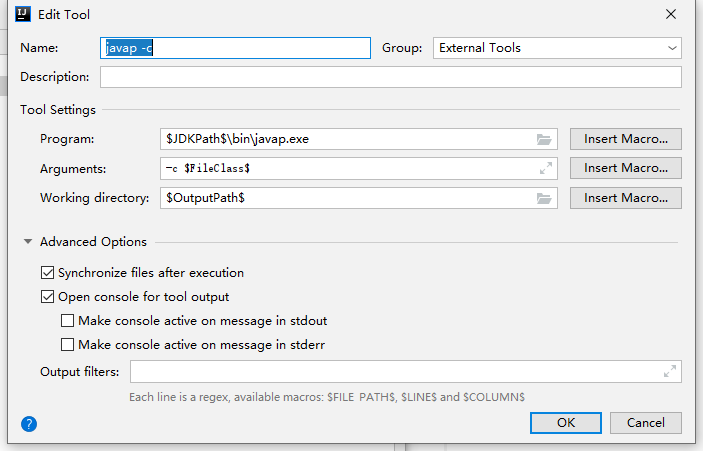

### Idea 添加JDK自带的反编译工具javap
- [Idea 添加JDK自带的反编译工具javap](https://blog.csdn.net/qq_40646143/article/details/105833724?utm_medium=distribute.pc_relevant.none-task-blog-BlogCommendFromMachineLearnPai2-1.channel_param&depth_1-utm_source=distribute.pc_relevant.none-task-blog-BlogCommendFromMachineLearnPai2-1.channel_param)

1. File -> settings -> Tools -> ExternalTools  #> add

2. 配置 Tool

