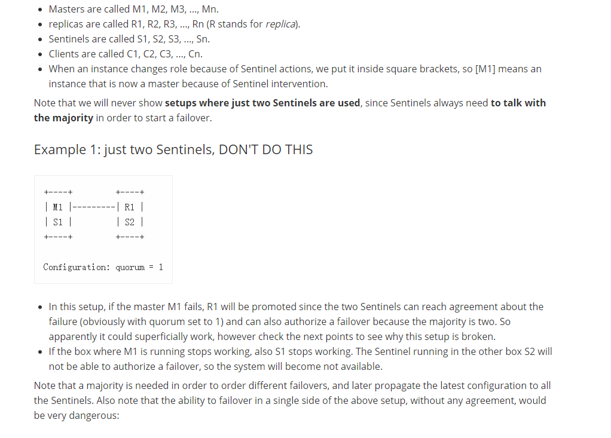

## Redis哨兵模式补充
1. 两台Redis的哨兵模式宕机后不会去切换
2. 三台Redis的，也存在问题

### 亲测
- 步骤一：3台Redis，down master后是否能够切换其他的做master?

    成功切换
- 步骤二：然后再down 掉master

    无法切换


#### 怎么解决呢：

每台服务器上配置两个哨兵怎么样？
```
port 26380
daemonize yes
protected-mode no
logfile "26380.log"
dir "./"

sentinel monitor mymaster 192.168.1.103 6379 1
sentinel down-after-milliseconds mymaster 10000
sentinel parallel-syncs mymaster 1
sentinel failover-timeout mymaster 15000
# sentinel auth-pass mymaster 123

bind 0.0.0.0
```
6哨兵+3服务看看能不能切换

- 步骤一：master down: 成功切换
- 步骤二：master 再down: 无用

#### 为什么会这样？


摘录自：



翻译一下：
```
示例1：仅两个Sentinels，不要这样做
+----+         +----+
| M1 |---------| R1 |
| S1 |         | S2 |
+----+         +----+

Configuration: quorum = 1
```
在此设置中，如果主M1发生故障，则R1将被提升，因为两个Sentinel可以就该故障达成协议（显然，仲裁数设置为1），并且由于大多数是两个，因此也可以授权故障转移。因此，显然它可以从表面上起作用，但是请检查以下几点，以了解为何此设置被破坏了。

**如果运行M1的盒子停止工作，则S1也停止工作。在另一个方框S2中运行的Sentinel将无法授权故障转移，因此系统将不可用。**

```text
示例2：三个框的基本设置
这是一个非常简单的设置，其优点是易于调整以提高安全性。它基于三个框，每个框同时运行Redis进程和Sentinel进程。

       +----+
       | M1 |
       | S1 |
       +----+
          |
+----+    |    +----+
| R2 |----+----| R3 |
| S2 |         | S3 |
+----+         +----+

Configuration: quorum = 2
如果主M1发生故障，则S2和S3将就该故障达成协议，并能够授权故障转移，从而使客户端能够继续。

在每个Sentinel设置中，由于Redis使用异步复制，因此始终存在丢失某些写入的风险，因为给定的已确认写入可能无法到达被提升为主副本的副本。但是，在上述设置中，由于客户端被旧的主服务器分区，因此存在较高的风险，如下图所示：

         +----+
         | M1 |
         | S1 | <- C1 (writes will be lost)
         +----+
            |
            /
            /
+------+    |    +----+
| [M2] |----+----| R3 |
| S2   |         | S3 |
+------+         +----+
在这种情况下，网络分区隔离了旧的主数据库M1，因此副本R2被提升为主数据库。但是，客户端（例如C1）与旧主服务器位于同一分区中，可以继续将数据写入旧主服务器。此数据将永远丢失，因为当分区恢复正常时，主服务器将被重新配置为新主服务器的副本，从而丢弃其数据集。

使用以下Redis复制功能可以缓解此问题，如果主服务器检测到不再能够将其写入转移到指定数量的副本，则该功能可以停止接受写入。

min-replicas-to-write 1
min-replicas-max-lag 10
使用以上配置（请参阅redis.confRedis发行版中的自我注释示例以获取更多信息），Redis实例在充当主实例时，如果无法写入至少1个副本，它将停止接受写入。由于复制是异步的，因此实际上无法写入意味着复制副本已断开连接，或者未向我们发送异步确认的时间超过了指定max-lag的秒数。

使用此配置，以上示例中的旧Redis主服务器M1将在10秒后不可用。分区修复后，Sentinel配置将收敛到新配置，客户端C1将能够获取有效配置并继续使用新的主配置。

但是没有免费的午餐。通过这种改进，**如果两个副本都已关闭，则主服务器将停止接受写入。这是一个权衡。**
```

- [Redis Sentinel 部分官方文档](https://redis.io/topics/sentinel)

### 由此可见
1. 两台Redis的哨兵模式宕机后不会去切换

2. 三台Redis的，也存在问题

这两个问题都是存在的！


