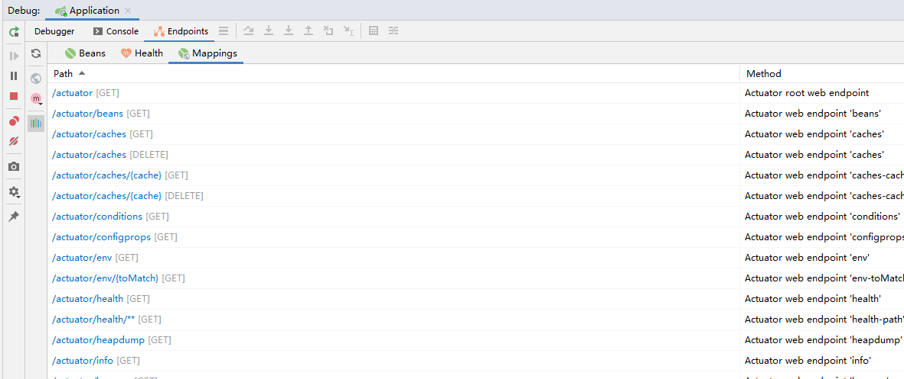

## 应用监控之 Spring Boot Actuator 使用及配置
### Actuator 简介

Actuator 是 Spring Boot 提供的对应用系统的自省和监控功能。通过 Actuator，可以使用数据化的指标去度量应用的运行情况，比如查看服务器的磁盘、内存、CPU等信息，系统的线程、gc、运行状态等等。

Actuator 通常通过使用 HTTP 和 JMX 来管理和监控应用，大多数情况使用 HTTP 的方式。


### Actuator 端点说明

- auditevents	获取当前应用暴露的审计事件信息
- beans	获取应用中所有的 Spring Beans 的完整关系列表
- caches	获取公开可以用的缓存
- conditions	获取自动配置条件信息，记录哪些自动配置条件通过和没通过的原因
- configprops	获取所有配置属性，包括默认配置，显示一个所有 @ConfigurationProperties 的整理列版本
- env	获取所有环境变量
- flyway	获取已应用的所有Flyway数据库迁移信息，需要一个或多个 Flyway Bean
- liquibase	获取已应用的所有Liquibase数据库迁移。需要一个或多个 Liquibase Bean
- health	获取应用程序健康指标（运行状况信息）
- httptrace	获取HTTP跟踪信息（默认情况下，最近100个HTTP请求-响应交换）。需要 HttpTraceRepository Bean
- info	获取应用程序信息
- integrationgraph	显示 Spring Integration 图。需要依赖 spring-integration-core
- loggers	显示和修改应用程序中日志的配置
- logfile	返回日志文件的内容（如果已设置logging.file.name或logging.file.path属性）
- metrics	获取系统度量指标信息
- mappings	显示所有@RequestMapping路径的整理列表
- scheduledtasks	显示应用程序中的计划任务
- sessions	允许从Spring Session支持的会话存储中检索和删除用户会话。需要使用Spring Session的基于Servlet的Web应用程序
- shutdown	关闭应用，要求endpoints.shutdown.enabled设置为true，默认为 false
- threaddump	获取系统线程转储信息
- heapdump	返回hprof堆转储文件
- jolokia	通过HTTP公开JMX bean（当Jolokia在类路径上时，不适用于WebFlux）。需要依赖 jolokia-core
- prometheus	以Prometheus服务器可以抓取的格式公开指标。需要依赖 micrometer-registry-prometheus

### Actuator 使用及配置

1. MAVEN
```
        <dependency>
            <groupId>org.springframework.boot</groupId>
            <artifactId>spring-boot-starter-actuator</artifactId>
        </dependency>
```
2. 启动项目



3. 启用与停用: `application.properties`文件
```
    # 启用所有端点
    management.endpoints.enabled-by-default=true
    #启动所有端点
    management.endpoints.web.exposure.include=*
    #自定义管理端点路径
    #management.endpoints.web.base-path=/manager
```


