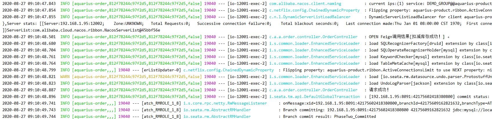

## 链路追踪

### Spring Cloud Sleuth
Spring Cloud Sleuth为分布式跟踪提供了Spring Boot自动配置。

将跟踪和跨度ID添加到Slf4J MDC，以便您可以从给定的跟踪或跨度中的日志聚合器中提取所有日志。

如果spring-cloud-sleuth-zipkin可用，则该应用将通过HTTP 生成并报告与Zipkin兼容的跟踪。默认情况下，它将它们发送到本地主机（端口9411）上的Zipkin收集器服务。使用来配置服务的位置spring.zipkin.baseUrl。

1. 引入Maven ：
    ```
        <dependency>
            <groupId>org.springframework.cloud</groupId>
            <artifactId>spring-cloud-starter-sleuth</artifactId>
        </dependency>
    ```
2. 什么都不需要改动，查看日志：


### ZipKin
Zipkin 是 Twitter 的一个开源项目，允许开发者收集 Twitter 各个服务上的监控数据，并提供查询接口。
该系统让开发者可通过一个 Web 前端轻松的收集和分析数据，例如用户每次请求服务的处理时间等，可方便的监测系统中存在的瓶颈。


- [下载server地址](https://repo1.maven.org/maven2/io/zipkin/zipkin-server/2.21.7/zipkin-server-2.21.7-exec.jar)

- [源码地址](https://github.com/openzipkin/zipkin/)


1. 从下载地址下载server
2. 运行springboot应用：`PS D:\developer\zipkin> java -jar .\zipkin-server-2.21.7-exec.jar`
3. 访问默认地址：http://localhost:9411/zipkin/

### Spring Cloud Sleuth + ZipKin

1. 集成Maven包
    ```
            <dependency>
                <groupId>org.springframework.cloud</groupId>
                <artifactId>spring-cloud-starter-zipkin</artifactId>
                <version>2.2.4.RELEASE</version>
            </dependency>
    ```
2. bootstrap.yml中配置
    ```
    ## zipkin
    spring.zipkin.enabled=true
    spring.zipkin.base-url=http://localhost:9411/
    ```
3. 其他都不需要动

### SkyWalking

- [官方地址](http://skywalking.apache.org/zh/)

TODO: 

- [SkyWalking 分布式追踪系统](https://www.jianshu.com/p/2fd56627a3cf)


### 问题
```
The bean 'feignHystrixBuilder', 
defined in class path resource [org/springframework/cloud/sleuth/instrument/web/client/feign/TraceFeignClientAutoConfiguration.class],
could not be registered. 
A bean with that name has already been defined in class path resource [com/alibaba/cloud/seata/feign/SeataFeignClientAutoConfiguration.class] 
and overriding is disabled.
```

解决方案：
spring.main.allow-bean-definition-overriding=true
