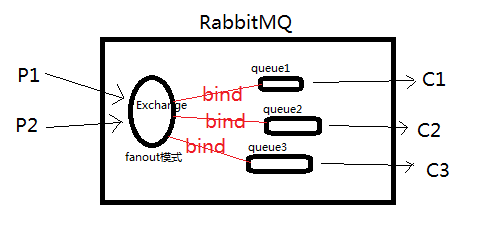

## RabbitMQ 

1. Exchange Type、Bingding key、routing key

在绑定（Binding）Exchange与Queue的同时，一般会指定一个binding key。在绑定多个Queue到同一个Exchange的时候，这些Binding允许使用相同的binding key。

生产者在将消息发送给Exchange的时候，一般会指定一个routing key，来指定这个消息的路由规则，生产者就可以在发送消息给Exchange时，通过指定routing key来决定消息流向哪里。

RabbitMQ常用的Exchange Type有三种：fanout、direct、topic。

- fanout:把所有发送到该Exchange的消息投递到所有与它绑定的队列中。
    fanout交换器中没有路由键的概念，他会把消息发送到所有绑定在此交换器上面的队列中。
- direct:把消息投递到那些binding key与routing key完全匹配的队列中。
    direct交换器相对来说比较简单，匹配规则为：如果路由键匹配，消息就被投送到相关的队列
- topic:将消息路由到binding key与routing key模式匹配的队列中。
    采用模糊匹配路由键的原则进行转发消息到队列中

### 安装

安装之前需要安装erlang
#### 下载地址
http://www.erlang.org/downloads

https://www.rabbitmq.com/download.html


在RabbitMQ官网的下载页面 https://www.rabbitmq.com/download.html 中，我们可以获取到针对各种不同操作系统的安装包和说明文档。这里，我们将对 windows 平台进行说明。

都安装最新版本的：

- [Erlang/OTP 23 下载地址](http://erlang.org/download/otp_win64_23.0.exe)
- [rabbitmq-server-3.8.7 下载地址](https://github.com/rabbitmq/rabbitmq-server/releases/download/v3.8.7/rabbitmq-server-3.8.7.exe)

#### 开始

1. 安装Erland，通过官方下载页面http://www.erlang.org/downloads获取exe安装包，直接打开并完成安装。
2. 安装RabbitMQ，通过官方下载页面https://www.rabbitmq.com/download.html获取exe安装包。 下载完成后，直接运行安装程序。
3. RabbitMQ Server安装完成之后，会自动的注册为服务，并以默认配置启动起来。注意如果安装360等软件要放行。


### Rabbit管理

我们可以直接通过配置文件的访问进行管理，也可以通过Web的访问进行管理。下面我们将介绍如何通过Web进行管理。

在 RabbitMQ的安装目录的 sbin 下，执行 rabbitmq-plugins enable rabbitmq_management 命令，开启Web管理插件，这样我们就可以通过浏览器来进行管理了。
`PS D:\Program Files\RabbitMQ Server\rabbitmq_server-3.7.7\sbin> .\rabbitmq-plugins.bat enable rabbitmq_management`

访问：http://localhost:15672/，并使用默认用户 guest 登录，密码也为 guest 。

添加用户`admin`，密码`admin123`，赋予权限

### 延时队列

1. 下载地址：
https://github.com/rabbitmq/rabbitmq-delayed-message-exchange/releases/tag/v3.8.0

2. 下载完成后放置到安装目录的，plugins文件夹下：`D:\Program Files\RabbitMQ Server\rabbitmq_server-3.8.7\plugins`

3. 安装插件：
`PS D:\Program Files\RabbitMQ Server\rabbitmq_server-3.7.7\sbin> .\rabbitmq-plugins.bat enable rabbitmq_delayed_message_exchange`

4. 完成
 
5. 最大延迟时间（毫秒）：
Integer.MAX_VALUE：2147483647
- 2147483.647	    秒(s)
- 35791.3941882	    分(min)
- 596.5232358	    时(h)
- 3.5507332	        周(week)
- 24.8551346	    天(d)
- 0.0680963	        年(yr)
- 2.1475e+15	    纳秒(ns)

> 参考： https://www.cnblogs.com/mfrank/p/11260355.html#autoid-0-4-0
>
### 消息确认
1. 生产者

2. 消费者

```
    //确认消息
    //channel.basicAck(deliveryTag, false);
    //拒绝消息：消息会被丢弃，不会重回队列
    //channel.basicReject(deliveryTag,false);
    //否认消息：（注意）重新入队列然后一直重新消费造成死循环
    //channel.basicNack(deliveryTag, false, true);
    //恢复消息到队列，参数是是否requeue，true则重新入队列，并且尽可能的将之前recover的消息投递给其他消费者消费，而不是自己再次消费。false则消息会重新被投递给自己。
    //channel.basicRecover(true);
```


## 集成遇到的问题

1. 多个消费者
多个消费者订阅同一个队列时，默认：消息将轮询发送给消费者。

## 官方文档
- [RabbitMQ Tutorials](https://www.rabbitmq.com/getstarted.html)

## 模式
 * fanout: 所有bind到此exchange的queue都可以接收消息，广播
 
 * direct: 通过routingKey和exchange决定的那个唯一的queue可以接收消息
 * topic:所有符合routingKey(此时可以是一个表达式)的routingKey所bind的queue可以接收消息
 * headers：通过headers来决定把消息发给哪些queue，用的比较少
