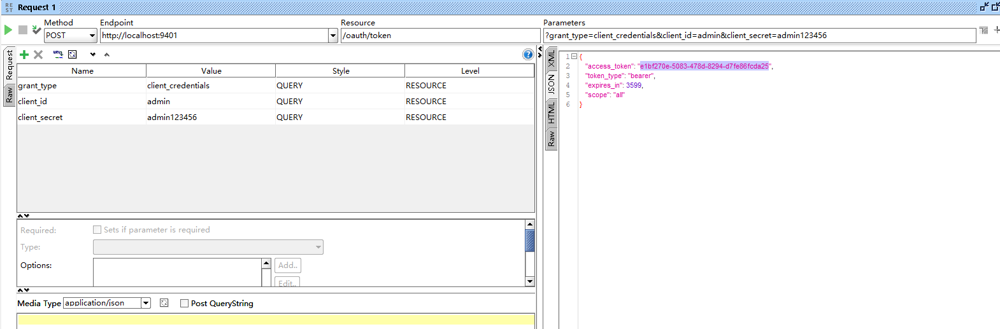

## oauth授权
- [参考文档](http://javajgs.com/archives/1479)
- [oauth2-demo](https://github.com/lexburner/oauth2-demo)

### 1. 授权码模式使用
1. 访问授权链接，获取授权码

    `http://localhost:9401/oauth/authorize?response_type=code&client_id=admin&redirect_uri=http://www.baidu.com&scope=all&state=normal`
2. 获取access_token
    `http://localhost:9401/oauth/token?grant_type=authorization_code&code=Q5XV3N&client_id=admin&scope=all&redirect_uri=http://www.baidu.com`

    

3. 通过access_token访问资源

    

### 2. 客户端模式授权
1. 访问链接直接获取access_token

    `http://localhost:9401/oauth/token?grant_type=client_credentials&client_id=admin&client_secret=admin123456`
    
    

2. 通过access_token访问资源同上

### 3. 用户名密码授权模式
1. 访问链接直接获取access_token
    `http://localhost:9401/oauth/token?grant_type=password&username=mark&password=123456`

2. 通过access_token访问资源同上

