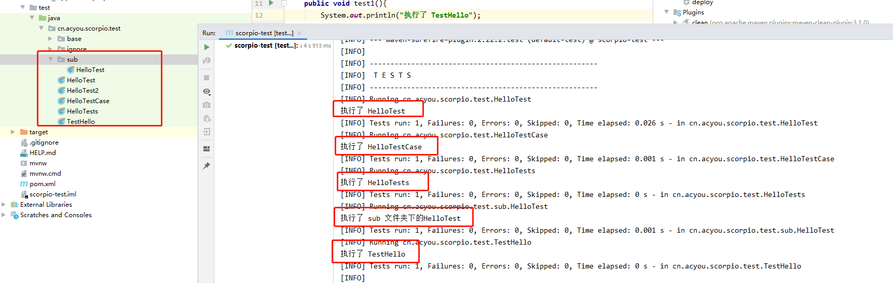
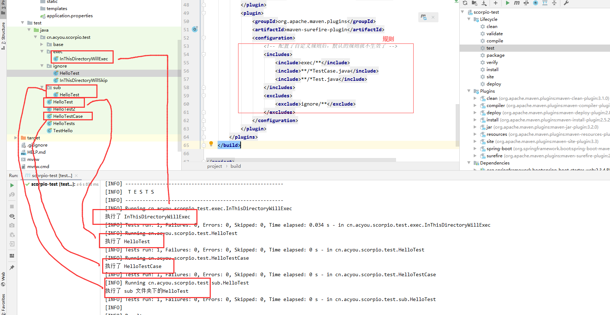

## 如何正确的使用单元测试

- [Maven test 介绍](http://maven.apache.org/surefire/maven-surefire-plugin/examples/single-test.html)
- [参考](https://blog.csdn.net/sin90lzc/article/details/7543262)

### 前言：跳过单元测试
##### 方法一：使用MVN命令
- mvn clean install -DskipTests

- mvn clean install -Dmaven.test.skip=true
##### 方法二：配置Maven的POM.xml中的plugins
```xml
        <!-- 编译：跳过单元测试 -->
        <plugin>
            <groupId>org.apache.maven.plugin</groupId>
            <artifactId>maven-compiler-plugin</artifactId>
            <version>2.1</version>
            <configuration>
                <skip>true</skip>
            </configuration>
        </plugin>
        <!-- 运行：跳过单元测试 -->
        <plugin>
            <groupId>org.apache.maven.plugins</groupId>
            <artifactId>maven-surefire-plugin</artifactId>
            <configuration>
                <skipTests>true</skipTests>
            </configuration>
        </plugin>
```
使用方法二中发现问题：

无论是执行`clean install`还是`clean install -Dmaven.test.skip=false`都不会执行测试，如果想执行测试怎么办？

所以这里引入方法三：
##### 方法三：配置Maven的POM.xml中的properties
```xml
    <properties>
        <java.version>1.8</java.version>
        <!-- 默认跳过测试，  同执行mvn clean install -Dmaven.test.skip=true  -->
        <!-- 可以通过命令来覆盖：  mvn clean install -Dmaven.test.skip=false -->
        <maven.test.skip>true</maven.test.skip>
    </properties>
```

### 1. maven-surefire-plugin
#### 1.1 简介
Maven本身并不是一个单元测试框架，它只是在构建执行到特定生命周期阶段的时候，通过插件来执行JUnit或者TestNG的测试用例。

这个插件就是maven-surefire-plugin，也可以称为测试运行器(Test Runner)，它能兼容JUnit 3、JUnit 4以及TestNG。
#### 1.2 工作原理
在默认情况下，maven-surefire-plugin的test目标会自动执行测试源码路径（默认为src/test/java/）下所有符合一组命名模式的测试类。这组模式为：

- **/Test*.java：任何子目录下所有命名以Test开关的Java类。
- **/*Test.java：任何子目录下所有命名以Test结尾的Java类。
- **/*Tests.java：任何子目录下所有命名以Test结尾的Java类。
- **/*TestCase.java：任何子目录下所有命名以TestCase结尾的Java类。

测试结果如下：



#### 1.3 动态指定要运行的测试用例

maven-surefire-plugin提供了一个test参数让Maven用户能够在命令行指定要运行的测试用例。如：

- `mvn test -Dmaven.test.skip=false,test=HelloTest` 执行单个测试类。
- `mvn test -Dmaven.test.skip=false,test=Hello*Test` 也可以使用通配符。
- `mvn test -Dmaven.test.skip=false,test=Hello*Test,HelloTestCase` 也可以使用","号指定多个测试类。

#### 1.4 包含与排除测试用例

测试类不符合默认命名模式时，可以通过pom.xml设置maven-surefire-plugin插件添加命名模式或排除命名模式。

注意：**配置了自定义规则后，默认的规则就不生效了**
```xml
        <plugin>
            <groupId>org.apache.maven.plugins</groupId>
            <artifactId>maven-surefire-plugin</artifactId>
            <configuration>
                <!-- 配置了自定义规则后，默认的规则就不生效了 -->
                <includes>
                    <include>exec/**</include>
                    <include>**/*TestCase.java</include>
                    <include>**/*Test.java</include>
                </includes>
                <excludes>
                    <exclude>ignore/**</exclude>
                </excludes>
            </configuration>
        </plugin>
```
测试结果如下：



#### 1.5 测试报告
1. 默认情况下，maven-surefire-plugin会在项目的target/surefire-reports目录下生成两种格式的错误报告。

2. `mvn cobertura:cobertura`生成覆盖率报告。


