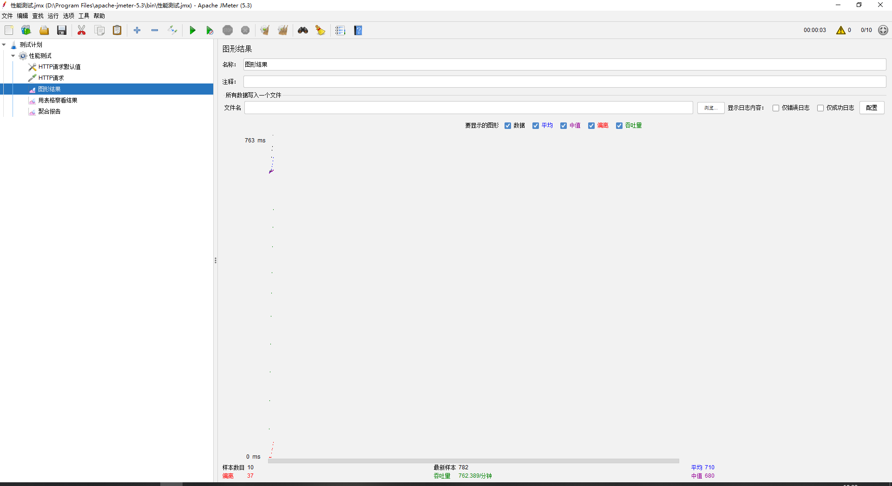
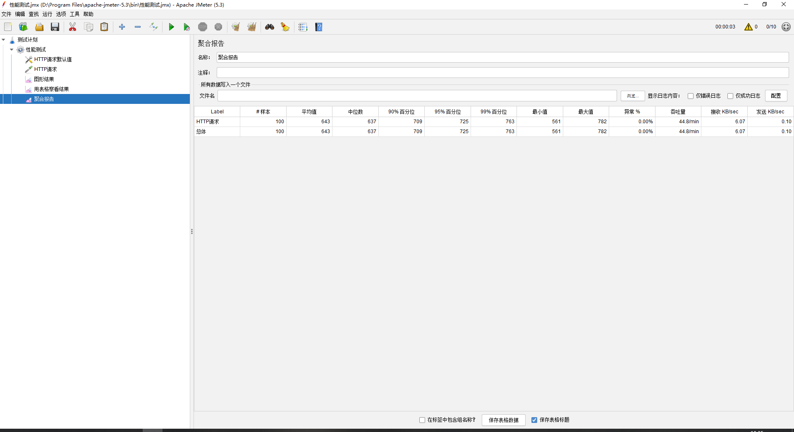

## Jmeter的使用
### 简介

Apache JMeter是一款纯java编写负载功能测试和性能测试开源工具软件。相比Loadrunner而言，JMeter小巧轻便且免费，逐渐成为了主流的性能测试工具，是每个测试人员都必须要掌握的工具之一。

### Jmeter安装

1.  安装JDK并配置环境变量（略）。
2. 下载Jmeter：[官网下载地址](http://jmeter.apache.org/download_jmeter.cgi)。
3. 下载完成后解压zip包。
4. 启动JMeter：双击JMeter解压路径（apache-jmeter-5.3\bin）bin下面的`ApacheJMeter.jar`即可。

> 汉化：
> 选项 -> 选择语言 -> 勾选中文

### Jmeter使用
使用也比较简单，配置示例：

1. 创建HTTP请求默认值。
2. 创建HTTP请求。
3. 创建需要的监听器。

这里对一个列表接口进行测试：`http://localhost:8034/sys/common/skupage`

测试结果：

#### 10次取样

#### 100次取样

### 结论

| Label    | # 样本 | 平均值 | 中位数 | 90% 百分位 | 95% 百分位 | 99% 百分位 | 最小值 | 最大值 | 异常 % | 吞吐量  | 接收 KB/sec | 发送 KB/sec |
| -------- | ------ | ------ | ------ | ---------- | ---------- | ---------- | ------ | ------ | ------ | ------- | ----------- | ----------- |
| HTTP请求 | 100    | 643    | 637    | 709        | 725        | 763        | 561    | 782    | 0.00%  | 0.74598 | 6.07        | 0.1         |
| 总体     | 100    | 643    | 637    | 709        | 725        | 763        | 561    | 782    | 0.00%  | 0.74598 | 6.07        | 0.1         |

一个简单查询接口平均耗时643ms